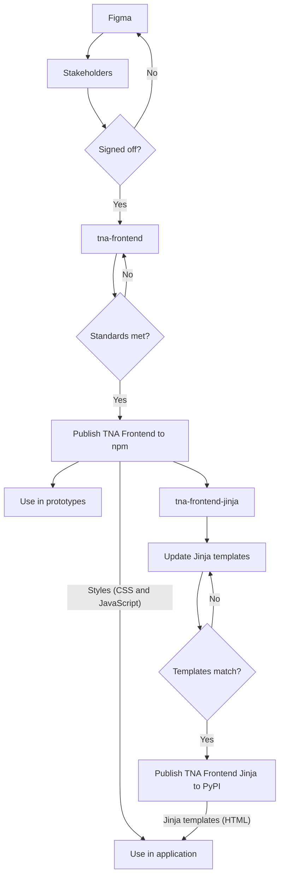

# Useful resources

## Status

| Resource                    | Status                                                                                                                                                              |
| --------------------------- | ------------------------------------------------------------------------------------------------------------------------------------------------------------------- |
| TNA Frontend                |              |
| TNA Frontend Jinja          |           |
| Docker images               |                    |
| Flask application template  |   |
| Django application template |  |

## Relationships

## Process for new components and styles

