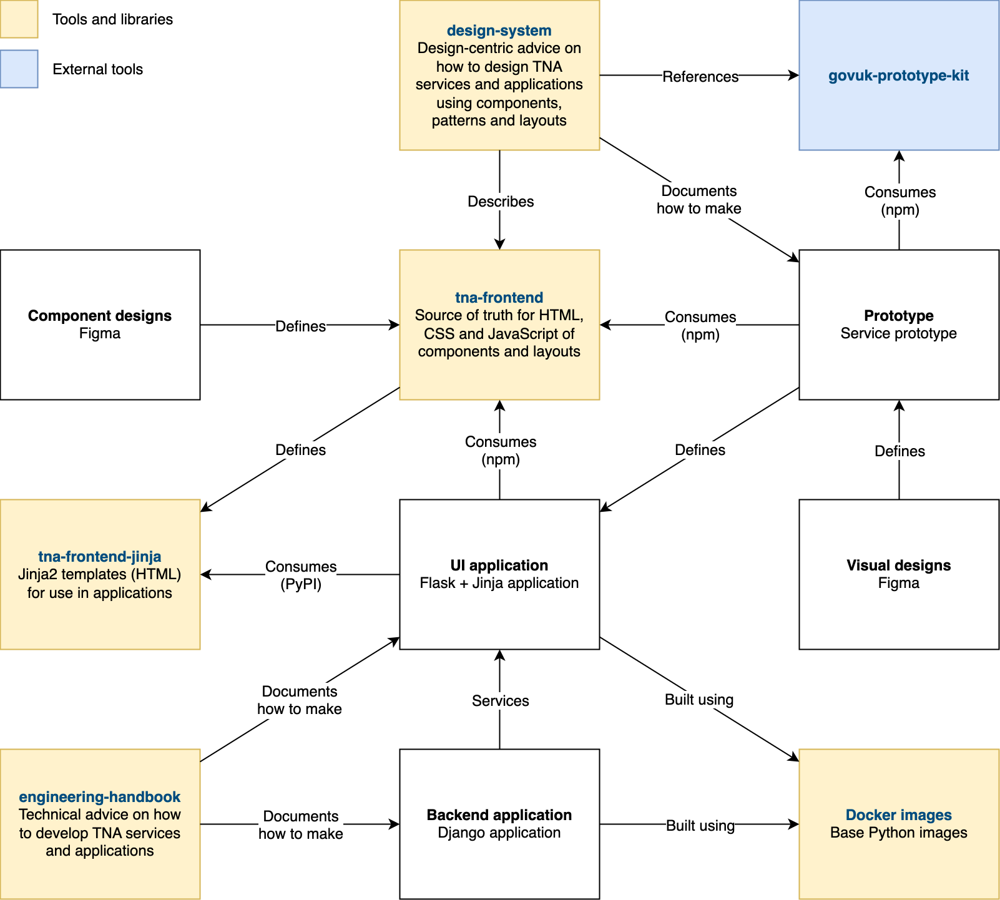

# Resources

| Resource                                                           | Status                                                                                                                                                               | Version                                                                                                                                                                                                                                                                                                                                                                                         |
| ------------------------------------------------------------------ | -------------------------------------------------------------------------------------------------------------------------------------------------------------------- | ----------------------------------------------------------------------------------------------------------------------------------------------------------------------------------------------------------------------------------------------------------------------------------------------------------------------------------------------------------------------------------------------- |
| [TNA Frontend](./tna-frontend.md)                                  |               |       |
| [TNA Frontend Jinja](./tna-frontend-jinja.md)                      |            |                        |
| [TNA Frontend Cookies](./tna-frontend-cookies.md)                  |       |                                                                                                                                                                                                                     |
| [TNA Frontend Analytics](./tna-frontend-analytics.md)              |     |   |
| [Docker images](./docker-images.md)                                |                     |                                                                                                                                                                                              |
| [Flask application template](./application-templates.md#flask)     |    |                                                                                                                                                                                                                                                                                                                                                                                                 |
| [Django application template](./application-templates.md#django)   |   |                                                                                                                                                                                                                                                                                                                                                                                                 |
| [FastAPI application template](./application-templates.md#fastapi) |  |                                                                                                                                                                                                                                                                                                                                                                                                 |
| [Design System](./design-system.md)                                |             |                                                                                                                                                                                          |
| [ESLint config](./linting-configurations.md#eslint)                |                 |                                                                                                                                                                                                         |
| [Stylelint config](./linting-configurations.md#stylelint)          |              |                                                                                                                                                                                                   |
| [Ruff config](./linting-configurations.md#ruff)                    |                   |                                                                                                                                                                                                                                          |
| [Python utilities](./python-utilities.md)                          |              |                                                                                                                                                                                                                                              |

## Relationships

