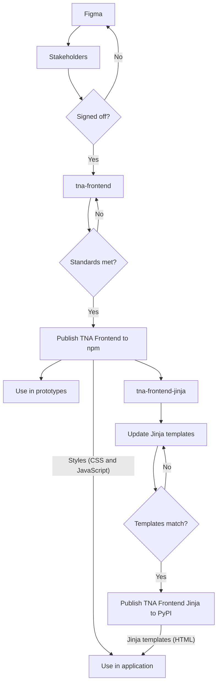

# Process for new components and styles

```mermaid
graph TD;
    Figma --> Stakeholders;
    Stakeholders --> Decision{Signed off?};
    Decision --> |Yes| tna-frontend
    Decision --> |No| Figma
    tna-frontend --> Tests{Standards met?};
    Tests --> |Yes| npm["Publish TNA Frontend to npm"]
    Tests --> |No| tna-frontend
    npm --> prototype["Use in prototypes"];
    npm --> tna-frontend-jinja;
    tna-frontend-jinja --> Update["Update Jinja templates"];
    Update --> JinjaTests{Templates match?};
    JinjaTests --> |Yes| PyPI["Publish TNA Frontend Jinja to PyPI"]
    JinjaTests --> |No| Update
    npm --> |"Styles (CSS and JavaScript)"|Application["Use in application"];
    PyPI --> |"Jinja templates (HTML)"|Application["Use in application"];
```
